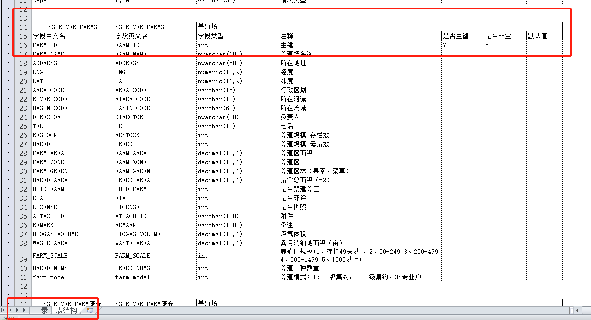
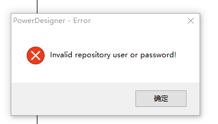
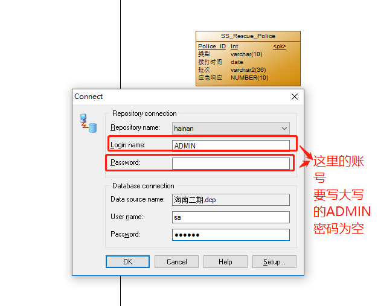

# PowerDesign

## 导成 excel库表说明文档

选中tables（如果不选中tables 就会生成所有的）
ctrl + shift +x 然后运行脚本

``` vbnet
'******************************************************************************
Option Explicit
   Dim rowsNum
   rowsNum = 0
'-----------------------------------------------------------------------------
' Main function
'-----------------------------------------------------------------------------
' Get the current active model
    Dim Model
    Set Model = ActiveModel
    If (Model Is Nothing) Or (Not Model.IsKindOf(PdPDM.cls_Model)) Then
       MsgBox "The current model is not an PDM model."
    Else
      ' Get the tables collection
      '创建EXCEL APP
      dim beginrow
      DIM EXCEL, SHEET, SHEETLIST
      set EXCEL = CREATEOBJECT("Excel.Application")
      EXCEL.workbooks.add(-4167)'添加工作表
      EXCEL.workbooks(1).sheets(1).name ="表结构"
      set SHEET = EXCEL.workbooks(1).sheets("表结构")
      
      EXCEL.workbooks(1).sheets.add
      EXCEL.workbooks(1).sheets(1).name ="目录"
      set SHEETLIST = EXCEL.workbooks(1).sheets("目录")
      ShowTableList Model,SHEETLIST

      ShowProperties Model, SHEET,SHEETLIST
      
      
      EXCEL.workbooks(1).Sheets(2).Select
      EXCEL.visible = true
      '设置列宽和自动换行
      sheet.Columns(1).ColumnWidth = 20 
      sheet.Columns(2).ColumnWidth = 20 
      sheet.Columns(3).ColumnWidth = 20 
      sheet.Columns(4).ColumnWidth = 40 
      sheet.Columns(5).ColumnWidth = 10 
      sheet.Columns(6).ColumnWidth = 10 
      sheet.Columns(1).WrapText =true
      sheet.Columns(2).WrapText =true
      sheet.Columns(4).WrapText =true
      '不显示网格线
      EXCEL.ActiveWindow.DisplayGridlines = False
      
      
 End If
'-----------------------------------------------------------------------------
' Show properties of tables
'-----------------------------------------------------------------------------
Sub ShowProperties(mdl, sheet,SheetList)
   ' Show tables of the current model/package
   rowsNum=0
   beginrow = rowsNum+1
   Dim rowIndex 
   rowIndex=3
   ' For each table
   output "begin"
   Dim tab
   For Each tab In mdl.tables
      ShowTable tab,sheet,rowIndex,sheetList
      rowIndex = rowIndex +1
   Next
   if mdl.tables.count > 0 then
        sheet.Range("A" & beginrow + 1 & ":A" & rowsNum).Rows.Group
   end if
   output "end"
End Sub
'-----------------------------------------------------------------------------
' Show table properties
'-----------------------------------------------------------------------------
Sub ShowTable(tab, sheet,rowIndex,sheetList)
   If IsObject(tab) Then
     Dim rangFlag
     rowsNum = rowsNum + 1
      ' Show properties
      Output "================================"
      sheet.cells(rowsNum, 1) =tab.name
      sheet.cells(rowsNum, 1).HorizontalAlignment=3
      sheet.cells(rowsNum, 2) = tab.code
      'sheet.cells(rowsNum, 5).HorizontalAlignment=3
      'sheet.cells(rowsNum, 6) = ""
      'sheet.cells(rowsNum, 7) = "表说明"
      sheet.cells(rowsNum, 3) = tab.comment
      'sheet.cells(rowsNum, 8).HorizontalAlignment=3
      sheet.Range(sheet.cells(rowsNum, 3),sheet.cells(rowsNum, 7)).Merge
      '设置超链接，从目录点击表名去查看表结构
      '字段中文名    字段英文名    字段类型    注释    是否主键    是否非空    默认值
      sheetList.Hyperlinks.Add sheetList.cells(rowIndex,2), "","表结构"&"!B"&rowsNum
      rowsNum = rowsNum + 1
      sheet.cells(rowsNum, 1) = "字段中文名"
      sheet.cells(rowsNum, 2) = "字段英文名"
      sheet.cells(rowsNum, 3) = "字段类型"
      sheet.cells(rowsNum, 4) = "注释"
      sheet.cells(rowsNum, 5) = "是否主键"
      sheet.cells(rowsNum, 6) = "是否非空"
      sheet.cells(rowsNum, 7) = "默认值"
      '设置边框
      sheet.Range(sheet.cells(rowsNum-1, 1),sheet.cells(rowsNum, 7)).Borders.LineStyle = "1"
      'sheet.Range(sheet.cells(rowsNum-1, 4),sheet.cells(rowsNum, 9)).Borders.LineStyle = "1"
      '字体为10号
      sheet.Range(sheet.cells(rowsNum-1, 1),sheet.cells(rowsNum, 7)).Font.Size=10
            Dim col ' running column
            Dim colsNum
            colsNum = 0
      for each col in tab.columns
        rowsNum = rowsNum + 1
        colsNum = colsNum + 1
          sheet.cells(rowsNum, 1) = col.name
        'sheet.cells(rowsNum, 3) = ""
          'sheet.cells(rowsNum, 4) = col.name
          sheet.cells(rowsNum, 2) = col.code
          sheet.cells(rowsNum, 3) = col.datatype
        sheet.cells(rowsNum, 4) = col.comment
          If col.Primary = true Then
        sheet.cells(rowsNum, 5) = "Y" 
        Else
        sheet.cells(rowsNum, 5) = " " 
        End If
        If col.Mandatory = true Then
        sheet.cells(rowsNum, 6) = "Y" 
        Else
        sheet.cells(rowsNum, 6) = " " 
        End If
        sheet.cells(rowsNum, 7) =  col.defaultvalue
      next
      sheet.Range(sheet.cells(rowsNum-colsNum+1,1),sheet.cells(rowsNum,7)).Borders.LineStyle = "3"       
      'sheet.Range(sheet.cells(rowsNum-colsNum+1,4),sheet.cells(rowsNum,9)).Borders.LineStyle = "3"
      sheet.Range(sheet.cells(rowsNum-colsNum+1,1),sheet.cells(rowsNum,7)).Font.Size = 10
      rowsNum = rowsNum + 2
      
      Output "FullDescription: "       + tab.Name
   End If
   
End Sub
'-----------------------------------------------------------------------------
' Show List Of Table
'-----------------------------------------------------------------------------
Sub ShowTableList(mdl, SheetList)
   ' Show tables of the current model/package
   Dim rowsNo
   rowsNo=1
   ' For each table
   output "begin"
   SheetList.cells(rowsNo, 1) = "主题"
   SheetList.cells(rowsNo, 2) = "表中文名"
   SheetList.cells(rowsNo, 3) = "表英文名"
   SheetList.cells(rowsNo, 4) = "表说明"
   rowsNo = rowsNo + 1
   SheetList.cells(rowsNo, 1) = mdl.name
   Dim tab
   For Each tab In mdl.tables
     If IsObject(tab) Then
         rowsNo = rowsNo + 1
      SheetList.cells(rowsNo, 1) = ""
      SheetList.cells(rowsNo, 2) = tab.name
      SheetList.cells(rowsNo, 3) = tab.code
      SheetList.cells(rowsNo, 4) = tab.comment
     End If
   Next
    SheetList.Columns(1).ColumnWidth = 20 
      SheetList.Columns(2).ColumnWidth = 20 
      SheetList.Columns(3).ColumnWidth = 30 
     SheetList.Columns(4).ColumnWidth = 60 
   output "end"
End Sub
```

<b>生成效果</b>:



## 数据库导入powerdesign

## 版本控制

### 连接仓库的时间报错

解决方案：

记得默认用户为大写ADMIN而非admin，Password:默认为空，这样就可以通过PD正确连接数据库了