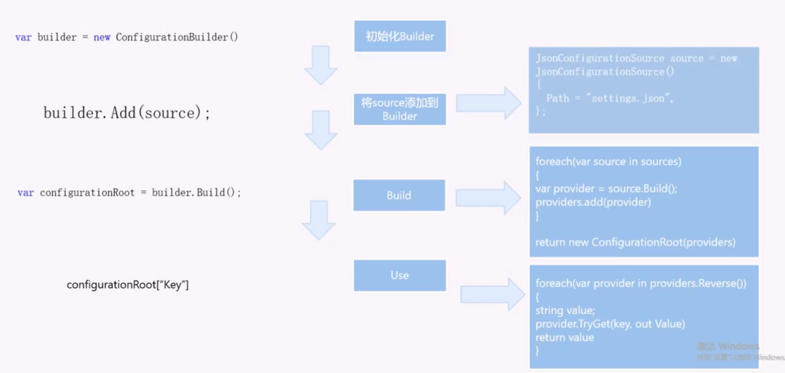
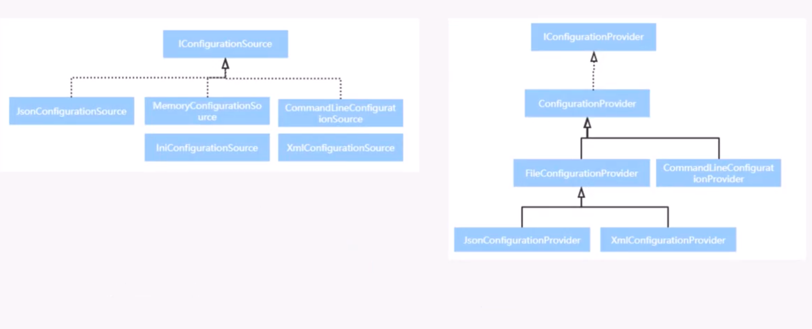
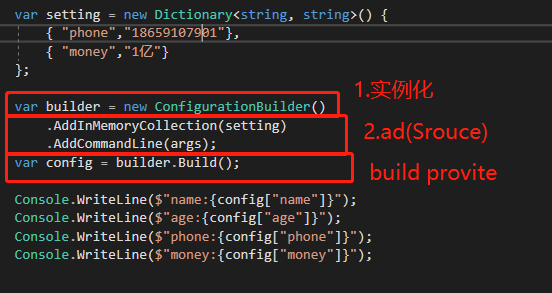
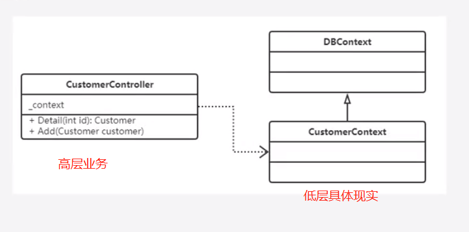
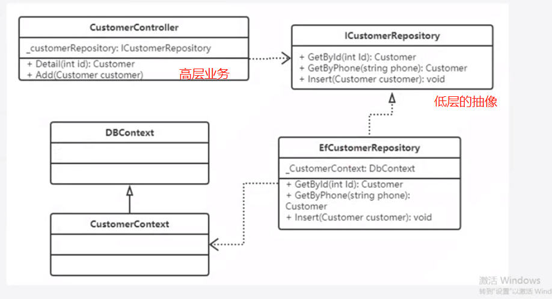
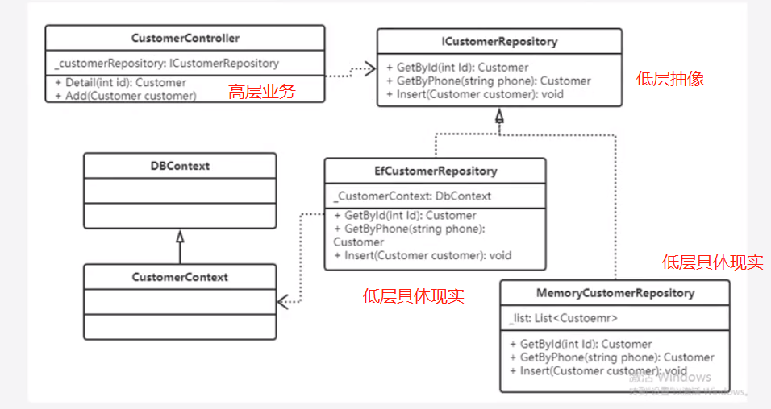

 # dotnet core

## 流程

1. 下载SDK或者下载vs2017以上版本
下载地址:https://www.microsoft.com/net/download
SDK:可以在其它工具使用，如vscode sublime.

SDK使用：

1. 验证是否已安装SDK成功
2. 新建目录 mkdir
3. dotnet命令学习：https://docs.microsoft.com/zh-cn/dotnet/core/tools/index?tabs=netcore2x

## 配置

### configuration、json 运用

### 热更新

asp 核心https://github.com/aspnet/MetaPackages 部份源码在src里面

## 框架结构



看代码demo

```cs
 var setting = new Dictionary<string, string>() {
                { "phone","18659107901"},
                { "money","1亿"}
            };

            var builder = new ConfigurationBuilder()
                .AddInMemoryCollection(setting)
                .AddCommandLine(args);
            var config = builder.Build();

            Console.WriteLine($"name:{config["name"]}");
            Console.WriteLine($"age:{config["age"]}");
            Console.WriteLine($"phone:{config["phone"]}");
            Console.WriteLine($"money:{config["money"]}");
```

## 显式依赖 隐式依赖

显示依赖：

整个类统一的进行的依赖，能过构告函数进行依赖

隐式依赖：
各自的方法进行自各的依赖，这样如果代码过多，方法过多，就无法不知道自己引用了包含多少依赖

## 依赖倒置
高级业主组件，不依赖低层的组件的具体现实，而依赖于低层的抽像



## 控制反转

