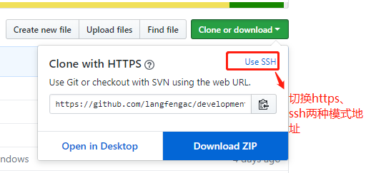
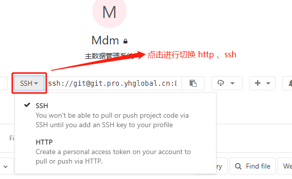

# git

## 安装

git官网下载gitbash for windows进行安装
配置本机账号等信息
```` cs
$ git config --global user.name "Your Name"
$ git config --global user.email "email@example.com"
````

### 暂存区

### 工作区

## linux常用命令

mkdir rm vim

### 文件操作

### 内容编辑

## 仓库

推送到远程仓库：git push origin master

获取更新远程仓库最新版本到本地：gitpull 和 git fetch
### 1.git clone
copy远程仓库到本地
```js
//examples
git clone  http://git.strongsoft.net:6280/devx/Choiwan40-net45-Framework.git

```
### 2.git pull

git pull 获取远程仓库最新版本，并执行merge操作
上述命令其实相当于git fetch 和 git merge
在实际使用中，git fetch更安全一些
因为在merge前，我们可以查看更新情况，然后再决定是否合并

### 3. git fetch

git fetch 获取远程仓库最新版本，但不会执行merge操作，所以git fetch后会执行`git merge origin/master`
例如：
``` js
git fetch origin master
git log -p master.. origin/master
git merge origin/master

```

上面的含义分别是：
从远程仓库 抓取master分支，但是不会merge
比较本地master分支与远程master分支的区别
合并远程分支到本地

上述过程其实可以用以下更清晰的方式来进行：
``` js
git fetch origin master-tmp
git diff tmp
git merge tmp
```
copy远程仓库到本地：git clone

### 4.查看远程仓库信息
`git remote show origin`

## 分支

查看分支：git branch

创建分支：git branch <name>

切换分支：git checkout <name>

创建+切换分支：git checkout -b <name>

合并某分支到当前分支：git merge <name>

删除分支：git branch -d <name>

强制删除分支：git branch -D <name>
当新建出来的分支还没合并就要直接删除的时候会提示分支还没合并。这里面要用-D进行强制删除

暂存bug分支：git stash


### 命令
1. 创建分支 `git branch dev`
切换分支 `git checkout dev`

快捷操作 `git checkout -b dev` 同义为：创建分支并切换到分支

2. 分支暂存:

## 历史
git log 查看commit的历史
git show <commit-hash-id>查看某次commit的修改内容
git log -p <filename>查看某个文件的修改历史
``` js
1. git log -p

2. git log -p comdata_hn2_rescue.xml

3. git log -p -2 comdata_hn2_rescue.xml
```

git diff

``` js
1.  git diff  filepath 工作区与暂存区比较

2. git diff HEAD filepath 工作区与HEAD ( 当前工作分支) 比较

3. git diff --staged 或 --cached  filepath 暂存区与HEAD比较

4. git diff branchName filepath  当前分支的文件与branchName 分支的文件进行比较

5. git diff commitId filepath 与某一次提交进行比较
```
## 标签

## 服务器搭建


## 工作流

## 密钥管理器 ssh-agent

如果有两个或以上的密钥最好用这个进行管理，避免每个push填自己的账号密码，它是以ssh方式的。

#### github

#### gitlab



