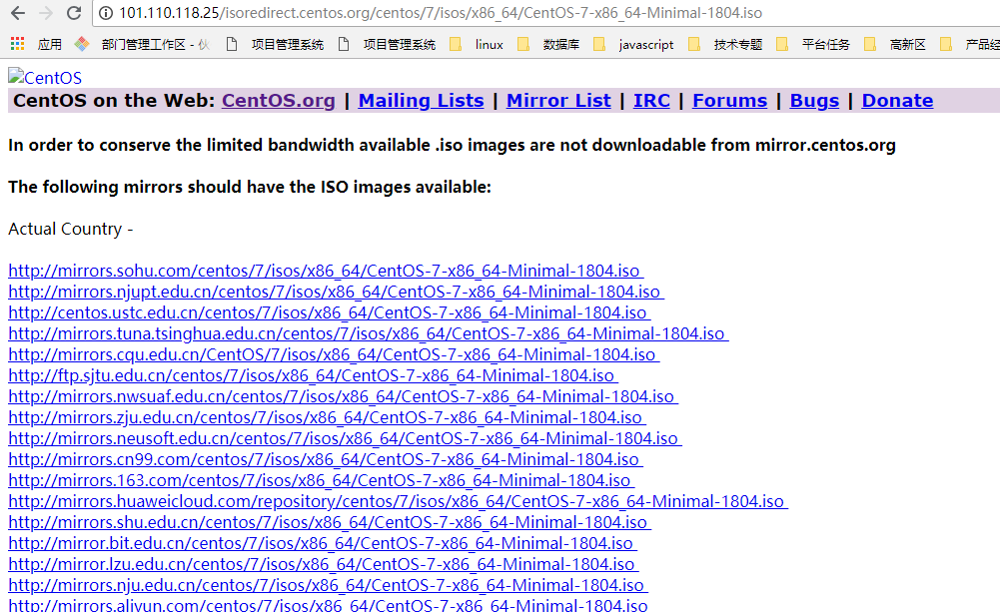

# Linux

## 系统安装

### 1、进入[www.centos.org](https://www.centos.org/download/) 下载

### 2、选择个最小的ISO 下载




### 3、新建虚拟主机 进行安装 基本默认下一步安装


### 4、新建完成后，选择开启虚拟主机，如果贞到以下问题，就关掉Hyper-v(这个docker的时候要开启这个)


### 5、然后启动，建行centos系统安装，基本也是默认下一步安装

### 6、安装完成 启动系统 `ping  www.baidu.com` `ifconfig`


安装最小版centos导致的，现在要开启这个服务，并安装ifconfig的命令工具

6.1 开启network服务 进去`/ect/sysconfig/network-scripts/`

6.2 编辑 ifcfg.cns33 文件 `vi ifcfg.ens33`  修改`ONBOOT=yes`


6.3 重启网卡 `service network restart` 说可以ping通了

### 7、 接下来 安装工具包 使ifconfig可以获取IP地址 运行`sudo yum install net-tools`,全选`y`


## 安装nginx

可以googole上查看 nginx install  on centos; 查到安装方法https://www.tecmint.com/install-nginx-on-centos-7/

### 1、更新系统的软件包到最新版本 `yum -y update`(可以不执行这个操作，很耗时)

### 2、关联启动EPEL库 安装nginx

```vim
yum install epel-release
yum install nginx
```


### 3、启动nginx

```vim
# systemctl start nginx 或 sudo ststemctl start nginx
# systemctl enable nginx
# systemctl status nginx
```


### 4、开通防火墙，允许防问

```vim
 firewall-cmd --zone=public --permanent --add-service=http
 firewall-cmd --zone=public --permanent --add-service=https
 firewall-cmd --reload
```

### 5、 外部访问的通就说明安装好了


### 6、nginx 重要文件地址说明

默认的服务器根目录(包含配置文件的顶层目录):`/etc/nginx`
主要的Nginx配置文件:`/etc/nginx/nginx.conf`
可以在:`/etc/nginx/conf.d`中添加服务器块(虚拟主机)
配置默认的服务器文档根目录(包含web文件):`/usr/ share/nginx/html`

## 问题附件
1、执行 `nginx -s reload` 重新加载nginx配置时报错
`nginx: [error] open() "/run/nginx.pid" failed (2: No such file or directory)`


解决方法：权限不足 无法打开
执行 `sudo nginx -c /etc/nginx/nginx.conf`
然后再 执行`nginx -s reload` 发现就可以了


## vim多行注释方法
vim安装运行：`yum install -y vim*  //在线安装vim`

1. 取消注释

 1、Ctrl+V 块化

 2、上下选择多行

 3、安d 取消注释

2. 多行注择

 1、Ctrl+v 块化

 2、上下键选择多行

 3、大写I

 4、按‘#’

 5、按ESC

 6、稍后之前选中的行也会出现# 的注释

图解：

 **2、上下键选择多行**

  

** 3、大写I**

  

** 4、按‘#’**

   

** 5、按ESC,稍后之前选中的行也会出现# 的注**

   

